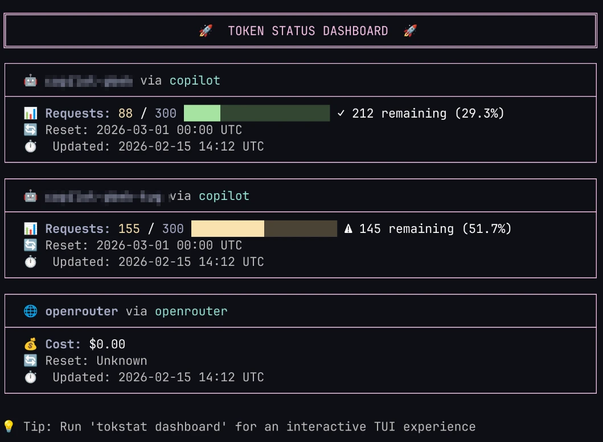
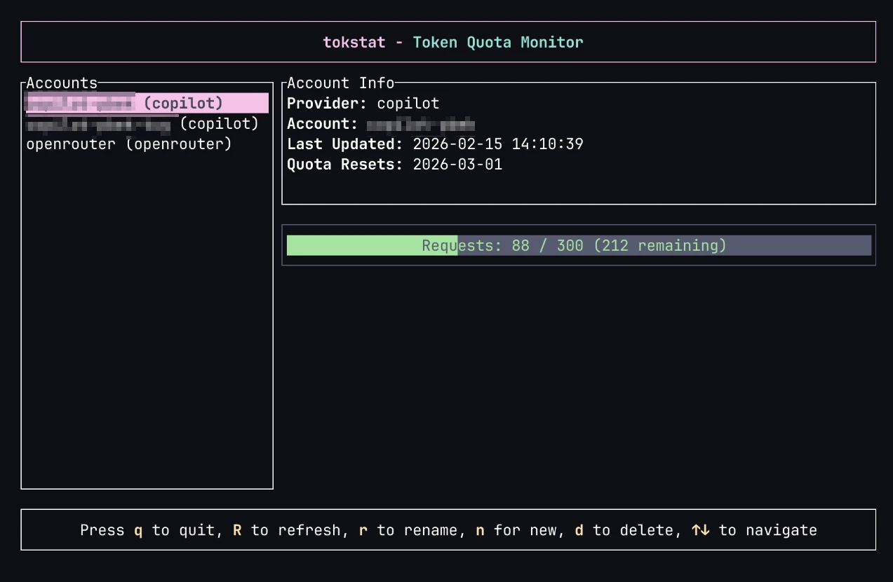

# tokstat

A beautiful CLI application to monitor token quotas across multiple AI providers with a stunning TUI dashboard.

## Screenshots

### CLI Output



### Dashboard



## Features

- **Multi-Provider Support**: Monitor GitHub Copilot, OpenRouter, and more
- **Pluggable Architecture**: Easily add new AI providers
- **Secure Credential Storage**: Uses system keyring for secure credential storage
- **Beautiful TUI Dashboard**: Real-time quota monitoring with a gorgeous terminal UI
  - Visual gauges with color-coded progress bars (Green <50%, Yellow 50-80%, Red >80%)
  - Quota history tracking with timestamps
  - Interactive account management (add, rename, delete)
  - Works even without any accounts configured
- **OAuth Flow**: Seamless GitHub OAuth device flow for Copilot login with clipboard support
- **Smart CLI Output**: Beautiful colored output with automatic fallback for piping
- **JSON Export**: Export quota data as JSON with `--json` flag
- **Shell Completions**: Built-in completions for Bash, Zsh, Fish, PowerShell, and Elvish
- **NixOS Support**: Complete Nix flake for easy installation and development

## Supported Providers

- **GitHub Copilot**: OAuth device flow login
- **OpenRouter**: API key authentication

More providers coming soon! See [AGENTS.md](AGENTS.md) for the roadmap of AI agent platforms and providers we plan to support.

## Installation

### Using Nix Flakes

```bash
# Run directly
nix run github:pbek/tokstat

# Install to profile
nix profile install github:pbek/tokstat

# Add to your NixOS configuration
{
  inputs.tokstat.url = "github:pbek/tokstat";

  # Then in your configuration:
  environment.systemPackages = [
    inputs.tokstat.packages.${system}.default
  ];
}
```

### Building from Source

```bash
# Using Nix
nix build

# Using Cargo
cargo build --release
```

## Usage

### Add a Provider Account

#### GitHub Copilot

```bash
tokstat login copilot --name my-copilot
```

This will start the OAuth device flow. Follow the instructions to authorize the app.

#### OpenRouter

```bash
tokstat login openrouter --name my-openrouter
```

You'll be prompted to enter your API key.

### List Accounts

```bash
tokstat list
```

### View Dashboard

```bash
tokstat dashboard
```

The dashboard provides:

- Real-time quota information
- Usage gauges and progress bars
- Auto-refresh every 60 seconds
- Keyboard navigation

**Keyboard Controls:**

- `↑`/`↓` or `j`/`k`: Navigate between accounts
- `R`: Refresh quota data for all accounts
- `r`: Rename the selected account
- `n`: Add a new account
- `d`: Delete the selected account (with confirmation)
- `q` or `Esc`: Quit

**Interactive Features:**

- **Visual Gauges**: Color-coded progress bars for Requests, Tokens, and Cost (Green <50%, Yellow 50-80%, Red >80%)
- **Quota History**: View historical quota changes directly in the dashboard
- **Account Management**: Add, rename, and delete accounts without leaving the dashboard
- **Copilot Integration**: Press `c` during OAuth flow to copy the verification code to clipboard
- **Quota Reset Info**: View when your quota limits will reset

### Refresh Quota Data

```bash
# Refresh all accounts
tokstat refresh

# Refresh specific account
tokstat refresh my-copilot
```

### JSON Output

```bash
# Export all account data as JSON
tokstat --json

# Perfect for scripting and automation
# Pipe to jq, save to file, or process programmatically
```

### Remove an Account

```bash
tokstat remove my-copilot
```

## Shell Completions

tokstat includes built-in shell completion support. When installed via Nix, completions are automatically installed.

### Manual Installation

```bash
# Bash
tokstat --generate bash > ~/.local/share/bash-completion/completions/tokstat

# Zsh
tokstat --generate zsh > ~/.zsh/completions/_tokstat

# Fish
tokstat --generate fish > ~/.config/fish/completions/tokstat.fish
```

See [COMPLETIONS.md](COMPLETIONS.md) for detailed instructions.

## Development

### Using Nix

```bash
# Enter development shell
nix develop

# Run the application
cargo run -- dashboard

# Watch mode
cargo watch -x run
```

### Architecture

The application is built with a pluggable provider architecture:

```
src/
├── main.rs              # CLI interface and command handling
├── auth/                # Authentication modules
│   ├── copilot.rs       # Copilot OAuth flow
│   └── openrouter.rs    # OpenRouter API key
├── providers/           # Provider implementations
│   ├── mod.rs           # Provider trait
│   ├── copilot.rs       # Copilot quota fetching
│   └── openrouter.rs    # OpenRouter quota fetching
├── storage/             # Secure credential storage
│   └── mod.rs           # Keyring integration
└── ui/                  # Terminal UI
    └── dashboard.rs     # TUI dashboard
```

### Adding a New Provider

1. Create a new file in `src/providers/` (e.g., `anthropic.rs`)
2. Implement the `Provider` trait
3. Add authentication logic in `src/auth/`
4. Update the match statements in `main.rs` and `providers/mod.rs`

Example:

```rust
use super::{Provider, QuotaInfo};

pub struct AnthropicProvider;

#[async_trait::async_trait]
impl Provider for AnthropicProvider {
    async fn fetch_quota(&self, credentials: &str) -> Result<QuotaInfo> {
        // Implementation
    }

    fn provider_name(&self) -> &str {
        "anthropic"
    }
}
```

## Security

- Credentials are stored securely using the system keyring
- OAuth tokens are encrypted at rest
- No credentials are logged or exposed in the UI

## Configuration

Configuration is stored in:

- **Linux**: `~/.config/tokstat/`
- **macOS**: `~/Library/Application Support/tokstat/`
- **Windows**: `%APPDATA%\tokstat\`

Credentials are stored in the system keyring.

## License

MIT License - see LICENSE file for details

## Contributing

Contributions are welcome! Please feel free to submit a Pull Request.

## Roadmap

- [ ] Add more providers (Anthropic, OpenAI, etc.)
- [ ] Export usage data to CSV/JSON
- [ ] Usage graphs and historical data
- [ ] Alerts when approaching quota limits
- [ ] Web dashboard option
- [ ] Multi-account comparison view
